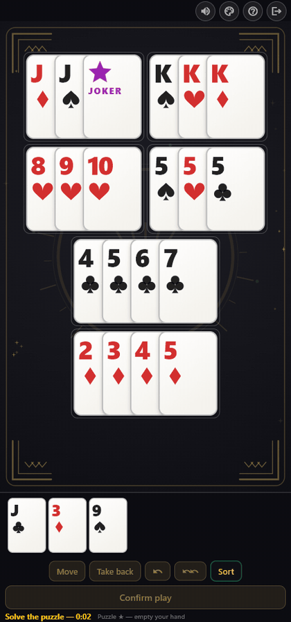
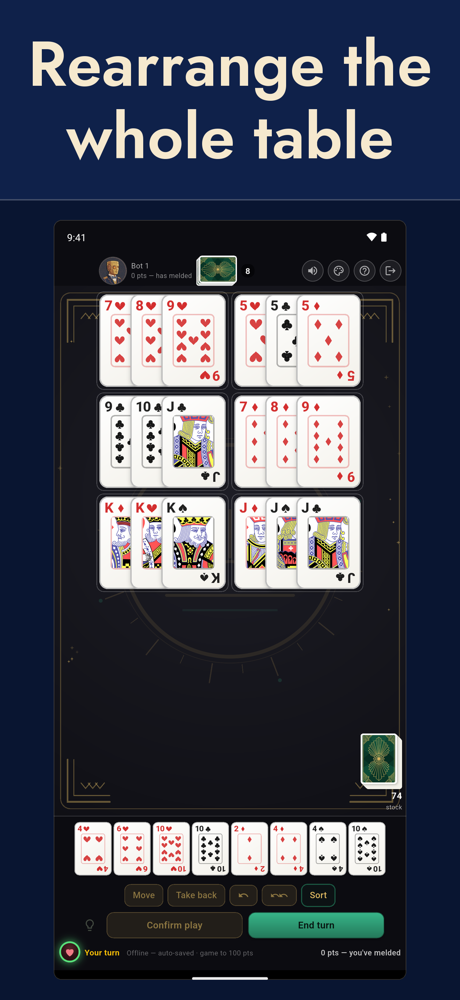
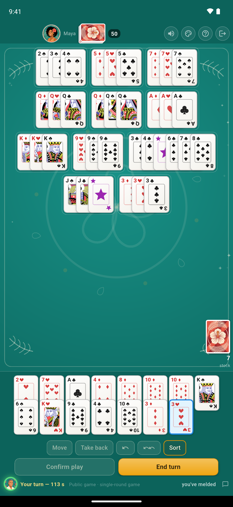
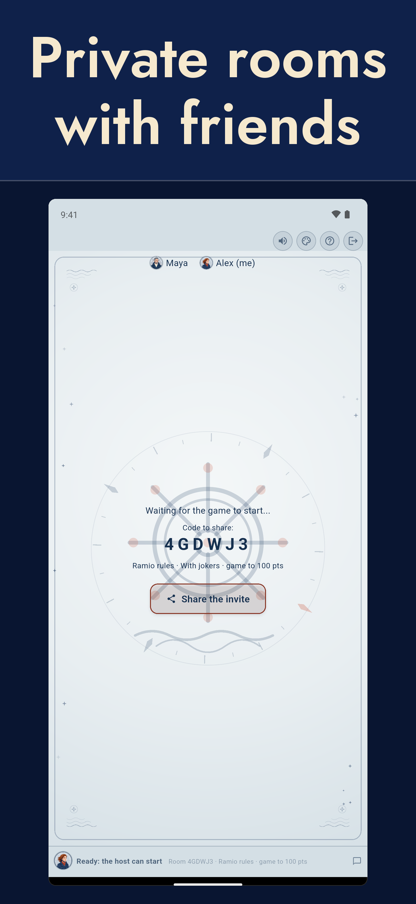
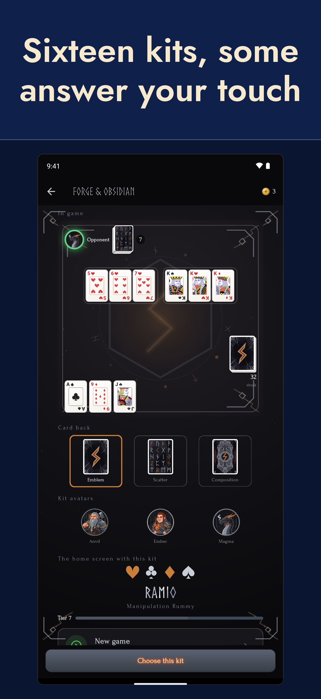

<a href="./">Version française</a>

# Ramio

**Ramio is Manipulation Rummy played with cards, online with friends
wherever you are.** You don't just lay
down your cards: you take apart and rebuild what is already on the
table to fit yours in.

  

## Try Ramio

The app is in **open beta**, free and without ads.

  <a href="https://play.google.com/store/apps/details?id=com.ramio"
     style="display:inline-block;margin:6px 8px;padding:14px 28px;border-radius:10px;
            background:#2f6f62;color:#fff;font-weight:600;text-decoration:none;">
    Android — get it on Google Play
  </a>
  <a href="https://testflight.apple.com/join/X8tt9MQw"
     style="display:inline-block;margin:6px 8px;padding:14px 28px;border-radius:10px;
            background:#2f6f62;color:#fff;font-weight:600;text-decoration:none;">
    iPhone — join the TestFlight beta
  </a>

  On iPhone, the beta is delivered through Apple's TestFlight app.

  
  
  
  

## The rules of Manipulation Rummy

Manipulation Rummy is played by 2 to 4 players with two 52-card decks,
with or without jokers. The game is known under many names: Robbers'
rummy in English, Räuber-Rommé in Germany, Machiavelli in Italy,
Mexe-Mexe in Brazil, rami voleur or rami chinois in France. The
essentials are below.

### The goal

Be the first to get rid of all your cards by laying them on the table
as combinations:

- **Run**: at least three consecutive cards of the same suit (the ace
  can sit before the 2 or after the king, but runs never wrap around:
  K-A-2 is not allowed).
- **Set**: three or four cards of the same rank, all suits different.

### How a turn works

1. Each player is dealt **13 cards**.
2. On your turn you **draw one card**, then you may lay down
   combinations. There is no discarding, ever: your hand only shrinks
   by melding.
3. **Opening**: your first meld must include a **clean run of three** —
   three consecutive cards of the same suit, without a joker.
4. Once you have opened, you may also **freely rearrange the table**
   (move, split and recombine everyone's melds) to fit your cards in,
   as long as the whole table is valid again at the end of your turn.
5. The **joker** stands for any card. On the table it can be reused
   during rearrangements, as long as it stays on the table. Jokers are
   optional: every game is created with or without them.

### End of a round, and scoring

A round ends when a player empties their hand. The others count
penalties: cards 2 to 10 at face value, court cards 10, aces 11 and
jokers 20 or 50 points (50 in the current version of the app). If the
stock runs out before anyone finishes, the round
stops and every player counts the cards left in their own hand.
Penalties add up from round to round; the game ends as soon as a player
reaches 100 points, and the least penalized player wins. The app also
offers a **single-round game**, ideal for a quick match.

## The Ramio app

- Private rooms with friends (6-character code) or public games
- Solo against the computer, **even offline**, with four levels
- More than 300 rearrangement puzzles, and a daily challenge shared by all
- Speed duels: the same puzzle for everyone, fastest wins
- With or without jokers, points game or single-round game
- Friends, messaging, Elo ranking, statistics and history
- Around twenty themes: table felts, card backs and avatars
- Available in eleven languages
- Automatic reconnection if your connection drops
- No ads, rules enforced by the server: cheating is impossible

## Privacy and contact

- [Privacy policy](privacy-policy)
- [Delete your account](delete-account)
- Contact: ramio.contact@gmail.com
