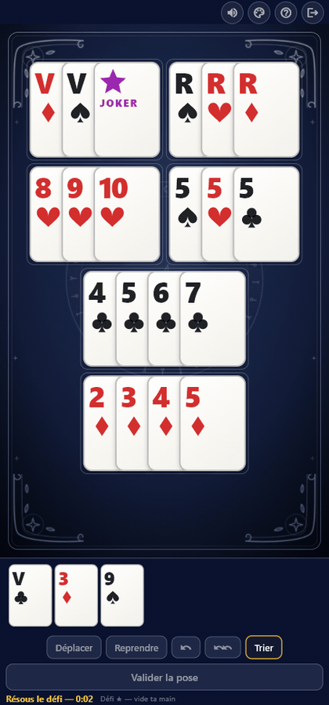
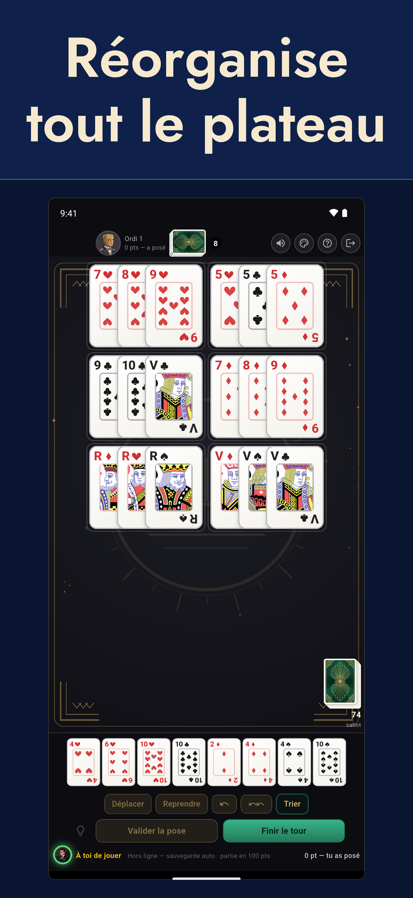
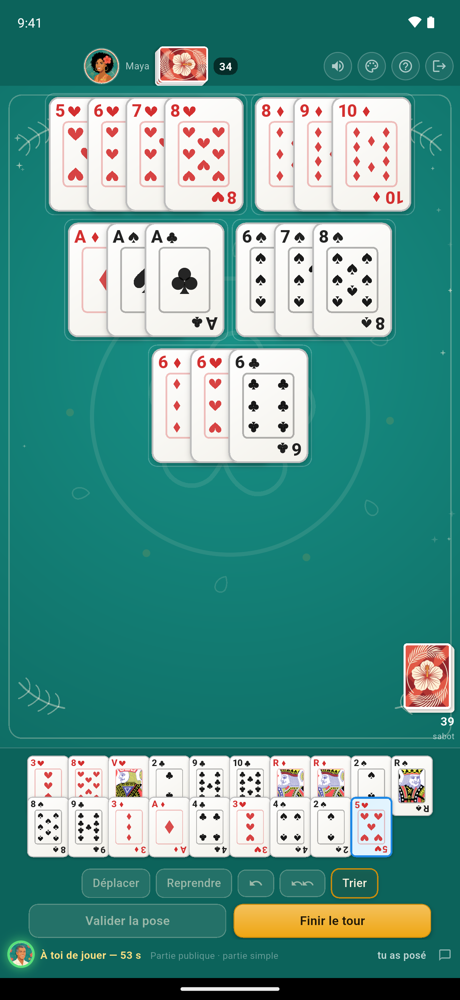
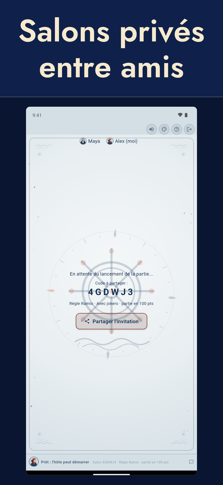
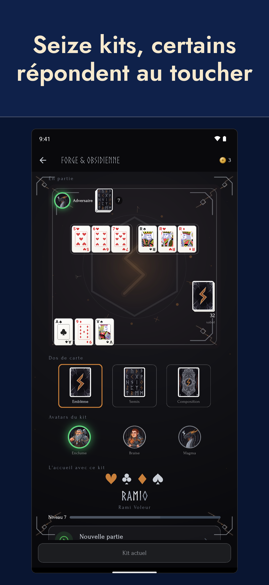

<a href="en">English version</a>

# Ramio

**Ramio, c'est le rami voleur — aussi appelé rami chinois — à jouer entre
amis où que vous soyez.** Vous ne posez pas seulement vos cartes : vous
démontez et recomposez celles qui sont déjà sur la table pour y glisser les
vôtres.

  

## Essayer Ramio

L'application est en **bêta ouverte**, gratuite et sans publicité.

  <a href="https://play.google.com/store/apps/details?id=com.ramio"
     style="display:inline-block;margin:6px 8px;padding:14px 28px;border-radius:10px;
            background:#2f6f62;color:#fff;font-weight:600;text-decoration:none;">
    Android — installer depuis Google Play
  </a>
  <a href="https://testflight.apple.com/join/X8tt9MQw"
     style="display:inline-block;margin:6px 8px;padding:14px 28px;border-radius:10px;
            background:#2f6f62;color:#fff;font-weight:600;text-decoration:none;">
    iPhone — rejoindre la bêta TestFlight
  </a>

  Sur iPhone, la bêta passe par l'application TestFlight d'Apple.

  
  
  
  

## Les règles du rami voleur (rami chinois)

Le rami voleur — ou rami chinois — se joue de 2 à 4 joueurs, avec deux
jeux de 52 cartes, avec ou sans jokers. L'essentiel est résumé
ci-dessous ; le guide complet, avec le détail des points et les
différences avec le rami classique et le Rummikub, est sur la page
[Règles du rami chinois](regles-rami-chinois).

### Le but du jeu

Être le premier à se débarrasser de toutes ses cartes en les posant sur
la table, sous forme de combinaisons :

- **Suite** : au moins trois cartes qui se suivent, de la même couleur
  (l'As peut se placer avant le 2 ou après le Roi, mais la suite ne
  « tourne » pas : Roi-As-2 est interdit).
- **Brelan ou carré** : trois ou quatre cartes de même valeur, de
  couleurs toutes différentes.

### Le déroulement

1. Chaque joueur reçoit **13 cartes**.
2. À son tour, un joueur **pioche une carte**, puis peut poser des
   combinaisons sur la table. On ne se défausse jamais : la main ne
   diminue qu'en posant.
3. **Première pose** : pour commencer à poser, il faut d'abord une
   **tierce franche** — trois cartes qui se suivent, de la même couleur,
   sans joker.
4. Une fois sa première pose faite, le joueur peut aussi **réorganiser
   librement la table** (déplacer, découper, recombiner les poses de tout
   le monde) pour caser ses cartes, tant que la table reste entièrement
   valide à la fin de son tour.
5. Le **joker** remplace n'importe quelle carte. Sur la table, il peut
   être réutilisé lors des réorganisations, tant qu'il reste sur la
   table. Les jokers sont optionnels : chaque partie se crée avec ou
   sans.

### La fin de manche et les points

La manche s'arrête quand un joueur a vidé sa main. Les autres comptent
leurs pénalités : les cartes 2 à 10 valent leur valeur, les figures 10,
l'As 11 et le joker 20 ou 50 points (50 dans la version actuelle de
l'application). Si la pioche s'épuise avant qu'un joueur ait fini,
la manche s'arrête et chacun compte les points restants dans sa main.
Les pénalités s'additionnent de manche en manche ; la partie se termine
dès qu'un joueur atteint 100 points, et le joueur le moins pénalisé
gagne. L'application propose aussi une **partie simple** : une seule
manche gagnante, idéale pour une partie rapide.

## L'application Ramio

- Salons privés entre amis (code à 6 caractères) ou parties publiques
- Solo contre l'ordinateur, **même sans connexion**, à quatre niveaux
- Plus de 300 défis de recomposition, et un défi du jour commun à tous
- Duels de rapidité : le même défi pour tout le monde, le plus rapide gagne
- Avec ou sans jokers, partie aux points ou partie simple
- Amis, messagerie, classement Elo, statistiques et historique
- Une vingtaine d'ambiances : tapis, dos de cartes et avatars au choix
- Disponible en onze langues
- Reconnexion automatique en cas de coupure
- Aucune publicité, règles arbitrées par le serveur : impossible de tricher

## Confidentialité et contact

- [Politique de confidentialité](politique-confidentialite)
- [Supprimer son compte](suppression-compte)
- Contact : ramio.contact@gmail.com

